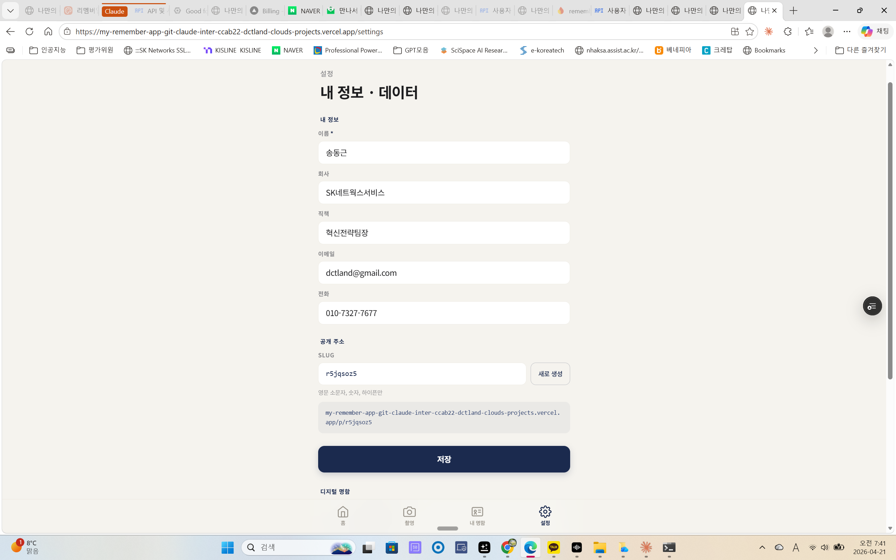

# 비개발자를 위한 "디지털 명함 앱" 만들기 매뉴얼

> 🎯 **이 문서의 목적**
> 코드 한 줄 안 쓰고도, 클로드(Claude)와 대화만으로 **실제로 배포되는 웹앱**을 만들어 본 전 과정을 기록한 "처음 써보는 분"을 위한 안내서입니다.
> 이 매뉴얼은 제가(비개발자) 직접 겪은 시행착오를 바탕으로 작성됐어요. 그래서 "이 버튼은 어디 있나요?" 같은 막막한 순간을 최대한 피하도록 썼습니다.

---

## 📑 목차

1. [우리가 만든 앱은 뭘 하는 앱인가](#1-우리가-만든-앱은-뭘-하는-앱인가)
2. [전체 그림 한눈에 보기](#2-전체-그림-한눈에-보기)
2.5 [Claude Code 설치 — 내 PC에 클로드 심기](#25-claude-code-설치--내-pc에-클로드-심기)
3. [준비물 — 무료 계정 4개](#3-준비물--무료-계정-4개)
3.5 [프로젝트 폴더 구조 한눈에 보기](#35-프로젝트-폴더-구조-한눈에-보기)
4. [(옵션) claude.ai/design 으로 디자인 시안부터 뽑기](#4-옵션-claudeaidesign-으로-디자인-시안부터-뽑기)
4.5 [Claude Code 하네스 셋업 — 내 클로드 무장시키기](#45-claude-code-하네스-셋업--내-클로드-무장시키기)
4.6 [Superpowers 스킬을 내 편으로 — 실전 흐름](#46-superpowers-스킬을-내-편으로--실전-흐름)
5. [Firebase 세팅 — 데이터 저장소 만들기](#5-firebase-세팅--데이터-저장소-만들기)
6. [Google Cloud 세팅 — 로그인 / Gmail 자동 발송용](#6-google-cloud-세팅--로그인--gmail-자동-발송용)
6.5 [로컬에서 앱 미리 보기 — 배포 전 내 PC 에서 돌리기](#65-로컬에서-앱-미리-보기--배포-전-내-pc-에서-돌리기)
7. [Vercel 세팅 — 앱을 인터넷에 올리기](#7-vercel-세팅--앱을-인터넷에-올리기)
8. [비개발자에게 정말 유용했던 6가지 꿀팁](#8-비개발자에게-정말-유용했던-6가지-꿀팁)
9. [Vercel Access Token — 왜 만들었고, 왜 꼭 폐기해야 하나](#9-vercel-access-token--왜-만들었고-왜-꼭-폐기해야-하나)
10. [실제로 겪었던 에러와 해결법](#10-실제로-겪었던-에러와-해결법)
11. [배포 후 유지보수 팁](#11-배포-후-유지보수-팁)
[부록 A: 주인님이 클로드에게 실제로 던진 말들 10가지](#부록-a-주인님이-클로드에게-실제로-던진-말들-10가지)

---

## 1. 우리가 만든 앱은 뭘 하는 앱인가

**"종이 명함을 받으면 스마트폰으로 찍기 → 자동으로 저장되고 → 상대방에게 인사 이메일이 나가는"** 앱입니다.

핵심 기능 4가지:

| 기능 | 설명 |
|---|---|
| 📷 명함 촬영 · 인식 | AI(Gemini)가 명함 이미지에서 이름·회사·이메일·전화번호를 뽑아냄 |
| 💾 여러 장 한 번에 업로드 | 모임에서 받은 명함을 한꺼번에 찍고 "1/5, 2/5..." 순으로 확인 |
| ✉️ 인사 이메일 자동 발송 | 저장 직후 5초 Undo 토스트 → 내 Gmail로 인사 메일 자동 발송 |
| 📇 휴대폰 연락처 저장 | `.vcf` 파일 자동 다운로드 → 상대방 정보를 폰 주소록에 바로 추가 |

그리고 **"내 디지털 명함"** 기능이 따로 있어요. 예를 들어 제 명함 주소는 `https://my-remember-app.vercel.app/p/r9jaoz5` 이고, 받은 사람은 앱 메뉴 없이 **명함 한 장만** 깔끔하게 봅니다.

---

## 2. 전체 그림 한눈에 보기

```
┌───────────────────────────────────────────────────────┐
│   비개발자(나)                                          │
│     ↓                                                   │
│   Claude Code 에게 "이런 앱 만들어줘" 라고 말함           │
│     ↓                                                   │
│   클로드가 코드를 씀 → GitHub 에 업로드                  │
│     ↓                                                   │
│   Vercel 이 GitHub 코드를 보고 자동으로 배포             │
│     ↓                                                   │
│   https://my-remember-app.vercel.app 에서 앱이 돌아감    │
│     ↓                                                   │
│   앱이 로그인하면 → Firebase 에 데이터 저장              │
│   앱이 이메일 보낼 때 → Google Gmail API 호출            │
│   앱이 명함 분석할 때 → Google Gemini API 호출           │
└───────────────────────────────────────────────────────┘
```

**비유로 설명하면:**
- **GitHub** = 코드 창고 (내 설계도 보관소)
- **Vercel** = 공장 + 가게 (설계도 보고 앱을 만들어서 인터넷에 진열)
- **Firebase** = 손님 정보 저장 창고 (누가 로그인했고, 명함을 몇 장 저장했는지)
- **Google Cloud** = 출입증 발급소 (Gmail 쓸 권한, 로그인 권한을 발급)

---

## 2.5 Claude Code 설치 — 내 PC에 클로드 심기

> 🎯 **3줄 요약**
> - **Claude Code** = 내 컴퓨터에서 돌아가는 클로드. 웹 클로드(claude.ai)와 달리 내 파일을 직접 읽고 수정함
> - 설치는 두 가지: **① VS Code 에디터 + Claude Code 확장팩** (추천) / **② 터미널 명령어**
> - 처음 실행하면 `.claude` 폴더가 자동 생성됨 (4.5 섹션의 하네스 설정이 여기에 들어감)

⏱️ 30분 · 🟡 중간 (한 번만 하고 끝)

### 2.5-1. Claude Code 가 뭔가요? 웹 클로드와 뭐가 다른가요?

| 구분 | 웹 클로드 (claude.ai) | **Claude Code** |
|---|---|---|
| 위치 | 브라우저 탭 | 내 PC 에 설치 |
| 파일 접근 | 내가 올린 파일만 | **내 PC 의 모든 파일 직접 읽기·수정** |
| 명령어 실행 | 불가 | **터미널 명령어 실행 가능** (git, npm, firebase 등) |
| 용도 | 대화·글쓰기·이미지 분석 | **코드 작성·앱 만들기·배포** |

한 줄 요약: **"웹 클로드가 상담사라면, Claude Code 는 비서. 비서가 내 PC 에서 직접 일함."**

### 2.5-2. 뭘 설치해야 하나 — VS Code 추천

Claude Code 를 실행할 "집" 이 필요합니다. 3가지 선택지:

| 집(에디터) | 특징 | 비개발자 추천도 |
|---|---|---|
| **VS Code** (마이크로소프트의 무료 코드 편집기) | 가장 대중적·자료 많음 | ⭐⭐⭐ **최우선 추천** |
| Cursor (AI 통합 에디터) | VS Code 기반 + AI 기능 강화 | ⭐⭐ (유료 $20/월, 익숙해지면 추천) |
| Antigravity (AI 에이전트 전용) | 최근 나온 신규 에디터 | ⭐ (정보 적음, 실험적) |

**저(주인님)는 Antigravity 에서 작업했지만**, 비개발자 첫 입문자에게는 **VS Code** 를 권합니다. 자료가 압도적으로 많고 에러 날 때 검색하기 쉬워요.

### 2.5-3. VS Code 설치 3단계

1. https://code.visualstudio.com 접속 → **"Download for Windows"** 클릭
2. 다운로드된 `.exe` 파일 실행 → **"I accept" → "Next" → "Next" → "Install"** (기본값으로 OK)
   - 도중에 **"관리자 권한 허용?"** 팝업이 뜨면 **"예"** 클릭
3. 설치 완료 후 VS Code 자동 실행

### 2.5-4. Claude Code 설치 3단계

VS Code 가 열린 상태에서:

1. 왼쪽 사이드바에서 **네모 4개 아이콘 (Extensions)** 클릭
2. 검색창에 **"Claude Code"** 입력 → Anthropic 이 만든 확장팩 선택 → **"Install"** 클릭
3. 설치 후 VS Code 창 **오른쪽 사이드바** 에 Claude 아이콘이 생김 → 클릭하면 로그인 유도

Anthropic 계정으로 로그인하면 끝. **첫 로그인 직후** Claude Code 가 `C:\Users\[내계정명]\.claude\` 폴더를 **자동으로** 만듭니다.

> 💡 **`.claude` 폴더 직접 안 만들어도 됩니다**. 클로드가 스스로 생성해요. 탐색기에서 확인하려면 **"숨김 파일 표시"** 를 켜야 보입니다 (폴더 옵션 → 숨김 파일 표시).

### 2.5-5. "터미널" 이 뭔가요? 어디서 여나요?

이 매뉴얼에서 몇 번 나올 용어입니다. 미리 풀어둘게요.

**터미널(Terminal)** = **명령어를 타이핑해서 PC 에 일을 시키는 검은 창**. 마우스 클릭이 아닌 글자로 명령.

Windows 11 에서 가장 편한 방법:
- **VS Code 창 안에서** `Ctrl + ~` (백틱) → 하단에 터미널 창 자동 등장
- 별도로 열려면 **시작 메뉴 → "Windows Terminal"** 검색

Claude Code 에게 "Firebase 배포해줘" 라고 말하면 **터미널에서 실행할 명령어를 클로드가 타이핑** 합니다. 저는 매뉴얼 전체에서 **터미널 명령어를 한 줄도 직접 친 적이 없어요**. 전부 클로드가 대신.

### 2.5-6. 플러그인 설치 — Superpowers, Frontend-design 등

섹션 4.5 에서 다룰 **플러그인 5개** 는 Claude Code 안에서 **`/plugin`** 명령으로 설치합니다.

1. VS Code 에서 Claude Code 창 열기
2. 입력창에 **`/plugin`** 타이핑 → 플러그인 마켓플레이스 열림
3. `superpowers`, `frontend-design`, `github`, `supabase` 검색해서 **Install**

이것도 클로드에게 **"Superpowers 플러그인 설치해줘"** 라고 말하면 대신 해줍니다.

> 🔄 **2.5-6 vs 4.5-2 관계 정리** (혼란 방지)
> - **2.5-6 (`/plugin` 마켓 설치)**: 플러그인 파일을 내 PC 에 **다운로드·설치** 하는 단계
> - **4.5-2 (`settings.json` 의 `enabledPlugins`)**: 설치된 플러그인을 **활성/비활성** 스위치 켜는 단계
> - **관계**: 마켓에서 설치하면 `settings.json` 에 **자동으로 `true` 로 등록됨**. 따로 타이핑 안 해도 됨.
> - **4.5-2 코드 예시는 "결과 확인용"**. 직접 손으로 쓸 필요 없고, **설치 후 자동 생성된 내용을 눈으로 확인**하는 용도예요.

### 2.5-7. 플랜 비용 — 매우 중요!

Claude Code 를 쓰려면 Anthropic 유료 플랜이 거의 필수입니다.

> 🚨 **플랜 비용 솔직하게**
> - **Pro 플랜** ($20/월): 가벼운 실험·공부용. Sonnet 모델 중심. 앱 하나 만들기엔 토큰 한도가 빠듯함.
> - **Max 5x 플랜** ($100/월): 이 매뉴얼 따라하기 **최소 권장**. Opus 일부 사용 가능.
> - **Max 20x 플랜** ($200/월): 저(주인님)가 쓴 플랜. 3주 동안 앱 하나 만들며 여유 있게 사용.
>
> 💡 **처음이면 Pro → 막히면 Max 5x 업그레이드** 순서 권장. 저는 처음부터 Max 20x 썼지만, 앱 하나라면 Max 5x 로 충분할 수 있습니다.

### 2.5-8. 설치 완료 체크

VS Code 를 다시 열고 다음 3가지가 되는지 확인:

1. ✅ 오른쪽 사이드바 Claude 아이콘 → 채팅창 뜸
2. ✅ `Ctrl + ~` → 하단에 터미널 창 등장
3. ✅ `C:\Users\[내이름]\.claude\` 폴더가 생겼다 (숨김 파일 표시 켠 뒤 확인)

> ✅ **이 섹션 완료 조건**
> - [ ] VS Code 와 Claude Code 확장이 설치되었다
> - [ ] Anthropic 계정으로 로그인했다
> - [ ] 터미널 여는 법을 안다 (Ctrl + ~)
> - [ ] 내 예상 플랜 비용을 이해했다

---

## 3. 준비물 — 무료 계정 4개 + 유료 1개

**서비스 계정 4개는 무료**로 시작. **Claude Code 만 유료** (2.5-7 참고).

| # | 사이트 | 용도 | 가입 링크 | 비용 |
|---|---|---|---|---|
| 1 | Google 계정 | Firebase·Google Cloud·Gemini 연결 | (이미 있을 거예요) | 무료 |
| 2 | GitHub | 코드 창고 | https://github.com/signup | 무료 |
| 3 | Firebase | 데이터베이스 + 로그인 | https://console.firebase.google.com | 무료 (개인 사용 범위) |
| 4 | Vercel | 앱 배포 | https://vercel.com/signup (GitHub 로 바로 가입) | 무료 (Hobby 플랜) |
| 5 | **Anthropic (Claude Code)** | **앱 제작 AI** | 가입: https://claude.ai/login<br>결제: https://claude.ai/settings/billing | **$20~$200/월** — 2.5-7 참고 |

> 💡 **팁**: 1~4번은 가능하면 **같은 Google 계정**으로 전부 연결하세요. 나중에 권한 설정할 때 훨씬 덜 헷갈립니다.
>
> ⏱️ **소요시간**: 1~4번 계정 만들기 총 15~20분. 이미 있는 계정이면 건너뛰기.

---

## 3.5 프로젝트 폴더 구조 한눈에 보기

> 🎯 **3줄 요약**
> - 클로드가 만드는 "앱 폴더" 안에는 **내 코드, 설정, 비밀키, 문서** 가 정해진 자리에 들어감
> - 비개발자는 **폴더 이름만 알아도 충분**. 내용은 클로드가 관리함
> - 단, `.env.local` 과 `.claude/` 두 폴더는 **내가 직접 관여**하게 됨 (비밀키·하네스 설정이라서)

⏱️ 5분 · 🟢 아주 쉬움 (읽기만 하면 됨)

이 섹션은 "내 컴퓨터에 생긴 이 이상한 폴더들은 다 뭐지?" 라는 막막함을 없애는 게 목적입니다. 다 외울 필요는 없고, **"아, 이 폴더는 이런 거였지"** 정도만 기억하면 됩니다.

### 3.5-1. 프로젝트 루트 전체 구조

```
리멤버앱만들기/                       ← 이게 "프로젝트 루트". 클로드와 내가 같이 작업하는 방.
│
├── src/                             ← 🧠 앱의 두뇌. 실제 코드가 전부 여기에
│   ├── app/                         ← 페이지(홈/촬영/설정 등)
│   ├── components/                  ← 재사용 UI 조각(버튼, 카메라 뷰 등)
│   ├── lib/                         ← Firebase·Gemini 연결 코드
│   └── types/                       ← 데이터 모양 정의(개발자용, 안 봐도 됨)
│
├── public/                          ← 🖼️ 아이콘, 로고, PWA 매니페스트
│
├── docs/                            ← 📚 문서 전용 폴더 (내가 자주 여는 곳!)
│   ├── 비개발자-앱만들기-매뉴얼.md   ← 지금 읽고 있는 이 문서
│   ├── 매뉴얼_화면/                 ← 매뉴얼에 쓴 스크린샷
│   ├── claude-design-package/       ← claude.ai/design 에서 받은 디자인 번들
│   └── superpowers/                 ← 클로드 스킬이 만든 설계 문서 (4.6 섹션 참고)
│       └── specs/                   ← "어떤 앱을 만들지" 설계도
│
├── .claude/                         ← ⚙️ Claude Code 하네스 설정 (4.5 섹션 참고)
│   ├── settings.local.json          ← 이 프로젝트에서 허용하는 명령 목록
│   └── launch.json                  ← 디버그 실행 방법
│
├── .env.local                       ← 🔐 비밀키 (절대 GitHub에 안 올라감)
├── .env.local.example               ← 비밀키 "서식" (예시만, 실키 아님)
├── .gitignore                       ← "이 파일들은 GitHub에 올리지 마" 목록
├── firebase.json                    ← Firebase 배포 설정
├── firestore.rules                  ← "누가 내 DB에 접근할 수 있나" 규칙
├── next.config.ts                   ← Next.js 프레임워크 설정
├── package.json                     ← 이 앱이 쓰는 무료 라이브러리 목록
├── README.md                        ← 앱 설명서 (GitHub 홈 화면에 뜸)
├── tsconfig.json                    ← TypeScript 설정 (개발자용)
├── node_modules/                    ← 🚚 설치한 라이브러리 (무겁고, GitHub에 안 올라감)
└── .next/                           ← 🏗️ 빌드 결과 캐시 (자동 생성/삭제)
```

### 3.5-2. 비개발자가 실제로 여는 폴더·파일 Top 5

| 순위 | 경로 | 언제 보나 | 누가 수정하나 |
|---|---|---|---|
| 1 | `docs/` | 매뉴얼 쓸 때, 디자인 번들 넣을 때 | **나** (손으로 끌어다 놓기) |
| 2 | `.env.local` | Firebase·Gemini 키 발급받은 직후 | **클로드** (내가 키 붙여주면 알아서 채움) |
| 3 | `.claude/settings.local.json` | 클로드가 "이 명령어 허용할까요?" 물어볼 때 자동 갱신 | **클로드** (내가 Allow 누르면 자동) |
| 4 | `README.md` | 누구한테 이 앱 공유할 때 | **클로드** (초기 작성 후 내가 약간 손댐) |
| 5 | `public/icon-*.png` | PWA 아이콘 바꿀 때 | **나** (디자인 툴로 만들어서 덮어쓰기) |

### 3.5-3. "열면 안 되는" 폴더 (그냥 두면 됨)

- `node_modules/` — 수만 개 파일. 열면 에디터가 버벅거림. `npm install` 때 자동 생성됨.
- `.next/` — 빌드 캐시. 삭제해도 다시 만들어짐.
- `.git/` — 버전 관리 데이터. 건드리면 기록 유실 위험. 클로드가 `git` 명령어로만 접근.

### 3.5-4. 왜 이렇게 폴더를 나누는지 (1분 설명)

- **`src/` (소스)** vs **`public/` (공개)** — 같은 "파일" 이지만 취급이 다릅니다. `src/` 는 빌드하면서 "압축·변환" 되고, `public/` 은 그대로 인터넷에 노출됩니다.
- **`.env.local` 과 `.env.local.example`** — 전자는 내 진짜 키, 후자는 "이 자리에 키를 넣으세요" 라는 빈 서식. GitHub 에는 빈 서식만 올라갑니다.
- **`docs/`** — 코드가 아닌 것은 전부 여기. 개발자 관례상 `docs/` 라는 이름이 약속입니다.

> 💡 **실제 경험**: 저는 초반에 "클로드가 만든 파일이 너무 많아서 어디가 뭔지 모르겠다" 고 당황했는데, 위 Top 5 만 기억하니 95% 해결됐어요.

> ✅ **이 섹션 완료 조건**
> - [ ] 내 프로젝트 폴더를 열어봤다
> - [ ] `docs/`, `.env.local`, `.claude/` 이 세 개 위치를 눈으로 확인했다
> - [ ] `node_modules/` 는 건드리지 않는다고 머릿속에 기억했다

---

## 4. (옵션) claude.ai/design 으로 디자인 시안부터 뽑기

코드 얘기하기 전에 **"앱 화면이 어떻게 생겼으면 좋겠다"** 부터 정리하면 Claude Code 가 훨씬 일을 잘합니다.

### 4-1. claude.ai/design 사용법

1. https://claude.ai/design 접속
2. 채팅창에 "명함 관리 앱 모바일 화면 만들어줘. 따뜻한 크림색 배경, 미니멀 스타일" 같이 입력
3. Claude 가 **실제로 돌아가는 HTML 프리뷰**를 바로 보여줌
4. 맘에 드는 시안을 고른 뒤 **"Download package"** 버튼 클릭
5. 받은 zip 파일을 풀면 아래 구조:
   ```
   claude-design-package/
   ├── README.md          ← Claude Code 에게 주는 가이드
   ├── chats/             ← 내가 Claude 와 주고받은 대화 기록
   └── project/           ← 실제 HTML/CSS/컴포넌트 코드
   ```
6. 이 폴더를 **통째로** 내 프로젝트 루트의 `docs/` 아래에 넣어두기

### 4-2. Claude Code 와 연동하는 법

VS Code(혹은 Cursor, Antigravity)에서 Claude Code 를 열고 이렇게 말하면 끝:

> "`docs/claude-design-package/` 안에 디자인 시안이 있어. 이 스타일을 유지하면서 명함 촬영·저장 기능 붙여서 Next.js 앱으로 만들어줘."

Claude 가 알아서:
- 디자인 패키지의 색상·폰트·컴포넌트를 읽고
- `src/app/`, `src/components/` 로 옮기고
- Tailwind CSS 설정을 맞춰줍니다.

> ⭐ **왜 좋냐면**: "화면을 말로 설명하는 것" 보다 "이미 생긴 화면을 보여주는 것" 이 훨씬 정확해요. 시행착오가 10분의 1로 줄었습니다.

---

## 4.5 Claude Code 하네스 셋업 — 내 클로드 무장시키기

> 🎯 **3줄 요약**
> - "하네스(harness)" = **안장+고삐** — 클로드를 내 의도대로 일 시키는 장치
> - 3곳만 손대면 끝: **글로벌 설정 / 글로벌 CLAUDE.md / 프로젝트 설정**
> - 설정 한 번 하면 **모든 프로젝트**에 적용됨 (재사용 가능)

⏱️ 20분 · 🟡 중간 (복붙 위주이지만 "왜" 이해가 필요)

### 🐎 하네스가 뭔가요? (비유 하나로 정리)

말 탈 때 **안장과 고삐가 없으면** 말이 제 마음대로 달려요. 클로드도 똑같습니다. 기본 상태의 클로드는:
- 아무 모델이나 써서 가끔 생각이 얕고
- 매 명령마다 "이거 실행해도 돼요?" 허락을 물어보느라 느리고
- 내가 누군지(비개발자·한국어·주인님 호칭) 매번 다시 설명해야 함

**하네스 = 이 세 가지를 "일회성 설정"으로 해결**하는 파일 3개. 한 번 만들면 **앞으로 모든 프로젝트**에서 재사용됩니다.

### 4.5-1. 3가지 설정 파일, 어디에 있나

| # | 파일 경로 | 역할 | 내가 손대는 횟수 |
|---|---|---|---|
| 1 | `C:\Users\[유저명]\.claude\settings.json` | **글로벌 하네스** — 모델·노력치·플러그인 | 한 번 설정하고 끝 |
| 2 | `C:\Users\[유저명]\.claude\CLAUDE.md` | **글로벌 규칙** — 호칭·언어·내 소개 | 한 번 작성하고 끝 |
| 3 | `[프로젝트]\.claude\settings.local.json` | **프로젝트별 권한** — 이 앱에서 허용할 명령만 | 프로젝트마다 자동 생성됨 |

> 💡 Windows 기준입니다. macOS 는 `~/.claude/settings.json` 같은 형식으로 동일합니다.

### 4.5-2. 글로벌 `settings.json` — 핵심 4줄

> 📁 **이 파일은 자동 생성됨**: Claude Code 를 처음 실행해 Anthropic 로그인하면 `C:\Users\[내계정명]\.claude\settings.json` 이 빈 형태로 자동 생성됩니다 (2.5-4 참고). 직접 만들 필요 X.
> 
> **편집 방법**: VS Code 에서 `Ctrl+Shift+P` → "Open User Settings" 로 열거나, **클로드에게 "내 글로벌 settings.json 열어서 이렇게 고쳐줘"** 라고 말하면 대신 편집해줍니다.

클로드에게 **"지금부터 내 클로드 가장 똑똑한 버전으로 세팅해줘"** 라고 말하면 아래와 같은 파일을 만들어 줍니다. 실제 저의 설정:

```json
{
  "model": "opus",
  "effortLevel": "xhigh",
  "skipAutoPermissionPrompt": true,
  "enabledPlugins": {
    "superpowers@claude-plugins-official": true,
    "frontend-design@claude-plugins-official": true,
    "github@claude-plugins-official": true,
    "supabase@claude-plugins-official": true,
    "codex@openai-codex": true
  }
}
```

**각 항목의 의미 (암기 불필요, 참고용)**

| 키 | 값 | 비개발자용 해석 |
|---|---|---|
| `model` | `opus` | 🧠 클로드의 "가장 똑똑한 두뇌" 를 기본 사용. (다른 선택지: `sonnet` 더 빠름·더 쌈, `haiku` 가장 빠름·가장 쌈) |
| `effortLevel` | `xhigh` | 🔥 "생각을 얼마나 오래 할까" 의 최대치. 복잡한 앱 만들 때 추천. |
| `skipAutoPermissionPrompt` | `true` | ✅ "허락 팝업" 줄이기. 일반적인 파일 편집은 자동 허용 (위험한 작업은 여전히 물어봄) |
| `enabledPlugins` | 5개 | 🔌 스킬 팩. Superpowers 가 **가장 중요** (4.6 참고). |

> ⚠️ **플랜 비용**: `model: opus` + `effortLevel: xhigh` 는 토큰을 많이 씁니다 (=Max 플랜 권장). 예산이 빠듯하면 **`sonnet` + `high`** 조합으로 먼저 써보세요. 플랜별 상세 비교는 **섹션 2.5-7** 참고.

### 4.5-3. 글로벌 `CLAUDE.md` — 나를 소개하는 편지

클로드는 대화 시작할 때 이 파일을 읽습니다. **"새 방에 들어온 친구에게 자기소개하는 편지"** 로 생각하세요.

> ✏️ **따라 쓸 때 주의**: 아래 예시에서 `dctla` 는 제 Windows 계정명입니다. **여러분은 자기 계정명으로 바꿔야** 합니다. 본인 계정명 확인: 파일 탐색기 → `C:\Users\` 열기 → 보이는 폴더 이름이 본인 계정명.

실제 저의 내용:

```markdown
# 전역 규칙 (모든 프로젝트에서 적용)

## 호칭
- 사용자를 "주인님"이라고 부를 것

## 사용자 정보
- 송동근 (비개발자)
- 한국어 사용
- 쉬운 설명 선호 (전문용어 사용 시 괄호 설명)
- 과도한 설명보다 바로 쓸 수 있는 결과물

## 스크린샷 위치
- 주인님이 Win + PrtScn 으로 캡쳐한 스크린샷은 아래 폴더에 자동 저장됨:
  C:\Users\dctla\OneDrive\사진\스크린샷\
- 파일명 패턴: 스크린샷(N).png (N이 큰 것이 최신)
- 주인님이 "캡쳐했어", "방금 찍은거 봐봐" 같이 말하면 먼저 이 폴더에서 최신 파일을 확인할 것
```

**이 편지가 하는 일:**
- 🎭 클로드가 나를 "주인님" 이라고 부름 (애정 있는 호칭 한 번 정해두면 매번 존중받는 느낌)
- 🈶 한국어로 설명 — 영어 문서 읽어야 할 때도 한국어 번역 함께
- 📸 **"방금 찍은 스크린샷 봐봐"** 한 마디면 클로드가 자동으로 최신 파일 읽음 (8.Tip 6 에서 자세히)

> 💡 **꿀팁**: 이 파일을 쓰는 가장 쉬운 방법은 **클로드한테 직접 시키기**입니다. "글로벌 CLAUDE.md 를 내 정보로 만들어줘. 호칭은 ○○, 한국어, 비개발자" 라고 말하면 위 양식으로 써줍니다.

### 4.5-4. 프로젝트별 `.claude/settings.local.json` — 자동으로 쌓이는 권한

이 파일은 **내가 쓸 일이 거의 없습니다**. 작업 중 클로드가 "`powershell.exe` 명령어 실행할까요?" 물어볼 때 **"Allow always"** 누르면 자동으로 이 파일에 추가됩니다.

실제 제 프로젝트 파일 일부:

```json
{
  "permissions": {
    "allow": [
      "Bash(powershell:*)",
      "Bash(npm install:*)",
      "Bash(curl:*)",
      "WebSearch",
      "Read(//c/Program Files/Microsoft OneDrive/**)"
    ]
  }
}
```

**의미**: 이 프로젝트에서는 이 명령들은 앞으로 묻지 말고 실행하라.

> 🚨 **주의**: 여기에 `Bash(*)` 처럼 **전체 허용**을 쓰면 안 됩니다. 위험한 파괴 명령(rm 등)도 묻지 않고 실행해서 사고날 수 있어요. 꼭 **필요한 것만 하나씩** 허용하세요.

### 4.5-5. 하네스 셋업이 바꾼 실제 차이

| Before (기본 클로드) | After (하네스 세팅 후) |
|---|---|
| "Haiku 로 답변합니다" (가끔 얕음) | "Opus + xhigh" — 설계까지 해줌 |
| 매 파일 수정마다 "허용?" 팝업 | 일반 편집은 자동 허용, 위험한 것만 물어봄 |
| 영어로 답변하다가 한국어로 | 무조건 한국어, 주인님 호칭 |
| "스크린샷 봐줘" → 경로 물어봄 | 자동으로 최신 파일 확인 |

### 4.5-6. 한 번에 다 세팅하는 지름길

**클로드한테 이렇게 한 마디 하면** 대부분 자동화됩니다:

> "내 Claude Code 를 비개발자용으로 하네스 세팅해줘. model 은 opus, effortLevel xhigh, Superpowers 와 frontend-design 플러그인 활성화. 글로벌 CLAUDE.md 에 호칭은 '주인님', 한국어, Win+PrtScn 스크린샷 경로는 `C:\Users\[내이름]\OneDrive\사진\스크린샷\` 으로 적어줘. 내 이름은 ○○○ 이고 비개발자야."

그러면 클로드가 두 파일을 자동 생성합니다.

> ✅ **이 섹션 완료 조건**
> - [ ] `settings.json` 에 model, effortLevel, enabledPlugins 3개가 들어있다
> - [ ] `CLAUDE.md` 에 내 호칭·언어·역할이 한 줄 이상씩 적혀있다
> - [ ] Superpowers 플러그인이 활성화된 상태다 (다음 섹션에서 쓸 것)

---

## 4.6 Superpowers 스킬을 내 편으로 — 실전 흐름

> 🎯 **3줄 요약**
> - Superpowers = **"일을 어떻게 해야 하는지" 알려주는 스킬 팩** (운전 기술에 해당)
> - 핵심 5가지: **브레인스토밍 → 설계 → 실행 → 디버깅 → 회고**
> - 클로드가 스스로 "지금은 이 스킬을 쓸 때" 라고 판단해 적용 (내가 외울 필요 X)

⏱️ 15분 · 🟡 중간 (읽어두면 큰 그림 이해됨)

### 4.6-1. 스킬이 뭔가요? 하네스와 뭐가 다른가요?

- **하네스 = 하드웨어** (엔진·안장·고삐) — 어떤 두뇌·어떤 권한·어떤 플러그인
- **스킬 = 소프트웨어** (운전 기술) — "문제 풀 때 어떤 순서로, 어떤 원칙으로 할지"

예: "집 벽지 칠하기" 를 의뢰받으면
- 하네스 : 사다리·롤러·페인트 (물리 도구)
- 스킬 : **"먼저 벽을 닦고, 모서리부터 칠하고, 건조시간 지켜라"** (순서·원칙)

### 4.6-2. 이 앱 만들 때 실제로 쓴 스킬 5개

제가 "명함 앱 만들어줘" 라고 말한 순간부터 클로드가 뒤에서 돌린 스킬들입니다. **제가 스킬 이름을 몰라도** 클로드가 알아서 적용합니다.

| # | 스킬 이름 | 언제 씀 | 제가 눈으로 본 결과물 |
|---|---|---|---|
| 1 | **brainstorming** | "이런 앱 만들어줘" 했을 때 | "이름·회사·직책 필드 필요?" 같은 질문 3~4개 먼저 던짐 |
| 2 | **writing-plans** | 브레인스토밍 직후 | `docs/superpowers/specs/2026-04-16-my-remember-app-design.md` 설계 문서 자동 생성 |
| 3 | **executing-plans** | 설계 끝나고 "만들어줘" | **Phase 1 → 2 → 3 → 4 → 5 → 6** 단계별 구현, 각 단계마다 커밋(commit: 변경 내용을 저장하는 "세이브 포인트") |
| 4 | **systematic-debugging** | "에러 떴어" 스크린샷 보낼 때 | 한 번에 고치지 않고 "원인 가설 3개 → 하나씩 검증" |
| 5 | **test-driven-development** | 중요 기능 구현 시 | 테스트 먼저 짜고 → 코드 작성 |

### 4.6-3. 증거: 실제 설계 문서 (writing-plans 결과물)

제가 "명함 앱 만들어줘" 한 직후 클로드가 `docs/superpowers/specs/2026-04-16-my-remember-app-design.md` 를 **자동으로** 만들었어요. 내용 일부:

```markdown
## 화면 구성 (5개)

### 1. 홈/명함 목록 화면
- 저장된 명함 카드 리스트 (이름, 회사, 직책 표시)
- 상단 검색바 ...

## 데이터 모델
### Firestore 컬렉션: `cards`
{ "userId": "...", "name": "홍길동", ... }

## 핵심 흐름
1. 사용자가 카메라로 명함 촬영
2. 브라우저에서 이미지 압축
3. Cloud Function이 Gemini 2.5 Flash API 호출
...
```

**왜 중요하냐면**: 코드 쓰기 **전에** 이 문서를 만들어서 주인님(나)에게 **"이 방향 맞나요?"** 를 물어봤어요. 그 덕에 중간에 "아 이거 아닌데" 하고 갈아엎는 일이 없었습니다.

### 4.6-4. 증거: 커밋 로그 = Phase 순차 실행 (executing-plans 결과물)

`git log` 로 본 실제 개발 흐름:

```
b51de3b Initial commit: design spec for My Remember App
df8aafa Phase 1: 프로젝트 초기 설정 (Next.js + Firebase + Auth)
0ec505d Phase 2: 명함 촬영 + AI 인식 기능 구현
7295e5d Phase 3: 데이터 저장 + 명함 목록/상세 기능 구현
74bdb31 Phase 4: 이메일 발송 기능 구현 (EmailJS 연동)
a4f4f29 Phase 5: 디지털 명함 + 설정 페이지 구현
a0733fb Phase 6: 디자인 폴리싱 + PWA 설정 + README 작성
```

**Phase 1 → 2 → 3 → 4 → 5 → 6** 이 보이죠? 이게 `executing-plans` 스킬의 결과입니다. 한 번에 몰아서 다 만들지 않고 **단계를 쪼개서** 각 단계마다:
1. 구현
2. 커밋 (되돌릴 수 있는 세이브 포인트)
3. 다음 Phase

### 4.6-5. 증거: 방향 전환 = systematic-debugging 결과물

초반 설계에는 **EmailJS** 로 이메일 보내게 되어있었는데, 실제 써보니 제한이 있어서 **Gmail 작성창 방식**으로 바꿨어요. 커밋 로그:

```
ad5d4ab Fix: 이메일 발송을 Gmail 작성창 방식으로 전환 + 명함 이름 자간 공백 제거
```

클로드는 "이 방식 안 돼요" 로 끝내지 않고 **"다른 방법 3개 비교 → 가장 단순한 것 선택"** 했어요. 이게 `systematic-debugging` 입니다.

### 4.6-6. 내가 외울 스킬 단 하나 — `brainstorming`

"새 기능 만들어줘" 라고 했을 때 클로드가 **질문 한두 개** 만 던지고 바로 코딩 시작하면, 저는 이렇게 말합니다:

> **"먼저 brainstorming 해줘."**

그러면 클로드가 **"이건 어떻게 할까요? 이 부분은?"** 5~7개 질문을 던지고, 제가 답하면 그때 본격 작업 시작. **이 한 단어만 알아도 앱 품질이 2배**가 됩니다.

### 4.6-7. 스킬 목록 보는 법

터미널에서 `/help` 치거나, 슬래시 `/` 누르면 자동완성에 스킬 목록이 뜹니다. 직접 호출도 가능:

```
/superpowers:brainstorming
/superpowers:writing-plans
/superpowers:executing-plans
/superpowers:systematic-debugging
```

> 💡 **솔직한 얘기**: 저는 이 스킬들을 **이름조차 모르고** 앱을 다 만들었습니다. 클로드가 알아서 쓰거든요. 이 섹션은 "이런 게 돌아가고 있었구나" 알려드리는 용도입니다. 나중에 더 복잡한 앱 만들 때 참고하세요.

> ✅ **이 섹션 완료 조건**
> - [ ] 하네스(4.5) 와 스킬(4.6) 의 차이를 한 줄로 설명할 수 있다
> - [ ] "brainstorming" 단어를 기억하고 있다
> - [ ] `docs/superpowers/specs/` 폴더가 내 프로젝트에도 생겼는지 확인했다

### 🔗 여기서 잠깐 — "그래서 코드는 언제 만들기 시작해요?"

좋은 질문입니다. 4.6 의 Phase 1~6 예시는 "이미 다 만든 후 돌아본 결과" 입니다. 실제 매뉴얼 순서는:

```
지금까지: 에디터 세팅(2.5) + 계정 준비(3) + 폴더 이해(3.5) + 디자인(4) + 하네스(4.5) + 스킬(4.6)
                                                                                          ↓
다음:    Firebase(5) + Google Cloud(6) 세팅
                                                                                          ↓
그 다음:  로컬에서 돌려보기(7 앞 새 섹션) → Vercel 배포(7)
                                                                                          ↓
중간중간:  명함 촬영·저장·이메일 등 실제 기능 구현 (클로드가 Phase 단위로)
```

**요약**: Firebase·Google Cloud 에서 값 받고 → `.env.local` 에 넣고 → 클로드한테 "Phase 1 부터 시작해줘" 라고 말하면 **그때부터 실제 코드가 만들어집니다**. 섹션 5~7 은 그 준비 과정이에요.

---

## 5. Firebase 세팅 — 데이터 저장소 만들기

> 🎯 **3줄 요약**
> - Firebase 콘솔에서 **10개 정도의 값**을 복사하게 됩니다 (무서워하지 마세요)
> - **값의 의미는 몰라도 됩니다**. 전부 메모장에 붙여넣은 뒤 **통째로 클로드한테 던지면** 알아서 `.env.local` 에 넣어줌
> - 저도 이 10개 중 단 하나도 의미를 몰랐습니다 — 그래도 앱은 돌아갑니다

⏱️ 30분 · 🟡 중간 (버튼 찾기가 메인, 이해는 안 해도 됨)

### 📦 이 섹션에서 "내가 할 일 10가지" — 미리 보기

비개발자에게 가장 무서운 순간이 이 섹션입니다. 미리 안심하세요:

> 🧘 **안심 가이드**
> 1. 10개 중 **실제 복사할 값은 6개**, 나머지 4개는 **클릭·드롭다운·선택**만
> 2. 복사한 값은 **의미 몰라도 OK**. 클로드에게 "이거 `.env.local` 에 넣어줘" 하면 끝
> 3. 실수해도 Firebase 콘솔에 영구 저장됨 — 언제든 다시 확인 가능

| # | 작업 | 유형 | 예시 | 어디서 (섹션) |
|---|---|---|---|---|
| 1 | apiKey 복사 | 📋 복사 | `AIzaSyB...` 39자 | 5-4 `firebaseConfig` |
| 2 | authDomain 복사 | 📋 복사 | `your-project-id.firebaseapp.com` | 5-4 `firebaseConfig` |
| 3 | projectId 복사 | 📋 복사 | `your-project-id` | 5-4 `firebaseConfig` |
| 4 | storageBucket 복사 | 📋 복사 | `your-project-id.firebasestorage.app` | 5-4 `firebaseConfig` |
| 5 | messagingSenderId 복사 | 📋 복사 | 12자리 숫자 | 5-4 `firebaseConfig` |
| 6 | appId 복사 | 📋 복사 | `1:935...:web:...` | 5-4 `firebaseConfig` |
| 7 | Google 로그인 토글 ON | 🖱️ 클릭 | (스위치 켜기) | 5-3 Authentication |
| 8 | 지원 이메일 드롭다운 | 📄 선택 | 내 Gmail | 5-3 Authentication |
| 9 | Firestore 위치 드롭다운 | 📄 선택 | `asia-northeast3` (서울) | 5-2 |
| 10 | 승인 도메인 추가 | ⏳ **나중에** | `my-remember-app.vercel.app` | 5-5 (섹션 7 배포 후) |

**유형별 합계**: 📋 복사 6개 · 🖱️ 클릭 1개 · 📄 선택 2개 · ⏳ 나중에 1개 = 합계 10개.
Firestore 보안 규칙(5-6)은 파일로 이미 준비돼있어서 "10개" 에서 제외(= 번호 없음).

---

### 5-1. 프로젝트 만들기

1. https://console.firebase.google.com 접속 → **"프로젝트 추가"**
2. 프로젝트 이름: 예) `remember-app` (저는 `your-project-id` 로 만들어짐 — 뒤 숫자는 자동 부여됨. 상관없음)
3. Google 애널리틱스는 **"사용 안 함"** 으로 둬도 됩니다 (쓸 일 거의 없음)

> ⏱️ **소요시간**: 3분. 마지막에 "프로젝트가 준비됐습니다" 문구가 뜨면 완료.

### 5-2. Firestore 데이터베이스 만들기

1. 왼쪽 메뉴 → **"빌드" > "Firestore Database"**
2. **"데이터베이스 만들기"** 클릭
3. 위치: **asia-northeast3 (서울)** 추천 → 이게 **작업 9번**
4. 시작 모드: **"테스트 모드"** 선택 (나중에 보안 규칙 조정 가능)

> 💡 **위치는 나중에 바꿀 수 없습니다**. 한국 사용자라면 서울로 꼭 선택하세요.

### 5-3. Authentication (로그인) 켜기

1. 왼쪽 메뉴 → **"빌드" > "Authentication"**
2. **"시작하기"** 클릭
3. 로그인 제공업체 목록에서 **"Google"** 선택
4. 들어가면 오른쪽 상단에 **토글 스위치** 가 있음 → **ON 으로 켜기** (= **작업 7번**)
5. **"프로젝트 지원 이메일"** 드롭다운 클릭 → 내 Gmail 선택 (= **작업 8번**)
6. **"저장"** 버튼 클릭 ← **이거 누르는 거 까먹지 마세요**. 저장 안 누르고 나가면 설정이 날아갑니다.

### 5-4. 웹 앱 등록해서 설정값 받기 ⭐ "값 1~6번 얻는 구간"

**이 구간이 이 매뉴얼 전체에서 가장 혼란스러운 순간**입니다. 화면이 바쁘게 바뀌니까 침착하게.

1. 프로젝트 개요(왼쪽 상단 "Project Overview") → **톱니바퀴 아이콘 ⚙️ > "프로젝트 설정"**
2. 아래로 스크롤 → **"내 앱"** 섹션 → **</> (웹)** 아이콘 클릭
3. 앱 별명 입력(예: `my-remember-app`) → **"앱 등록"**
4. 화면에 **`firebaseConfig` 코드 블록**이 나옵니다. 이게 **작업 1~6번** (복사해야 할 값 6개):

```js
const firebaseConfig = {
  apiKey: "AIzaSyBxxxxxxxxxxxxxxxxxxxxx",           // ← 값 1
  authDomain: "your-project-id.firebaseapp.com",      // ← 값 2
  projectId: "your-project-id",                       // ← 값 3
  storageBucket: "your-project-id.firebasestorage.app", // ← 값 4
  messagingSenderId: "123456789012",                 // ← 값 5
  appId: "1:123456789012:web:xxxxxxxxxxxxx"          // ← 값 6
};
```

> 📋 **정확히 어디서 어디까지 복사?**
> - **시작**: `const firebaseConfig = {` 의 첫 글자 `c`
> - **끝**: 닫는 중괄호 `}` 와 세미콜론 `;` 까지 (총 8줄 정도)
> - Firebase 콘솔 화면에서 코드 블록 오른쪽 위에 **📋 복사 아이콘**이 있으면 그것만 눌러도 OK
> - 그 위/아래의 `<script>` 태그나 `import` 문은 **포함할 필요 없음**
>
> 🎯 **다음 화면**: 복사 후 **"콘솔로 계속"** 버튼을 누르면 Firebase 대시보드로 돌아갑니다. Firebase SDK 선택 화면 같은 게 뜨면 기본값 그대로 두고 진행.

### 🚀 비개발자의 "실전 마법"

여기서 할 일은 딱 **하나**입니다:

1. 이 코드 블록을 **전체 드래그해서 복사** (Ctrl+C)
2. 클로드한테 이렇게 말하기:

> **"Firebase 설정값 받았어. 이거 `.env.local` 파일에 환경변수 형식으로 바꿔서 넣어줘. Vercel 배포 때 쓸 거야."**
>
> ```
> apiKey: "AIzaSy...",
> authDomain: "your-project-id.firebaseapp.com",
> ... (전체 붙여넣기)
> ```

클로드가 알아서 이렇게 변환해서 `.env.local` 에 넣습니다:

```
NEXT_PUBLIC_FIREBASE_API_KEY=AIzaSyBxxxxxxxxx...
NEXT_PUBLIC_FIREBASE_AUTH_DOMAIN=your-project-id.firebaseapp.com
NEXT_PUBLIC_FIREBASE_PROJECT_ID=your-project-id
...
```

> 🎯 **핵심**: 저는 `NEXT_PUBLIC_FIREBASE_API_KEY` 같은 **변수 이름을 단 한 번도 직접 타이핑하지 않았어요**. 그냥 `firebaseConfig` 블록 통째로 던졌습니다.

> ⚠️ **복사 실수 방지**: `firebaseConfig` 값은 **한 글자만 틀려도 앱이 안 됩니다**. 그래서 **직접 타이핑하지 마세요**. 100% 복사·붙여넣기.

### 5-5. 허용 도메인 추가 (= 작업 10번, **나중에 배포 후**)

> ⏳ **지금 하는 게 아닙니다!** — 이 단계는 섹션 7(Vercel 배포) 를 **완료한 후 돌아와서** 수행합니다. 지금은 읽고 넘어가세요. Vercel 도메인이 아직 없어서 입력할 값이 없어요.

Vercel 에 배포한 뒤 돌아와서 하는 작업입니다. 7번 섹션 끝나고 와서:

1. Authentication → **"Settings" 탭** → **"승인된 도메인"**
2. Vercel 에서 받은 도메인 2개 추가:
   - `my-remember-app.vercel.app`
   - `my-remember-app-사용자ID.vercel.app` (프리뷰용)

> 🚨 **이걸 빠뜨리면 `auth/unauthorized-domain` 에러**가 납니다. 저도 실제로 겪었어요. (10번 섹션 에러 2번 참고)

### 5-6. Firestore 보안 규칙 적용 (클로드가 자동으로 해줌)

"테스트 모드" 는 **30일 뒤 만료**되어 아무도 DB 를 못 읽게 됩니다. 진짜 규칙을 적용해야 합니다.

프로젝트 폴더의 `firestore.rules` 파일을 보면 클로드가 이미 써놓았어요:

```
rules_version = '2';
service cloud.firestore {
  match /databases/{database}/documents {
    match /cards/{cardId} {
      allow read, write: if request.auth != null
                         && request.auth.uid == resource.data.userId;
    }
    match /publicProfile/{profileId} {
      allow read: if true;
      allow write: if request.auth != null
                   && request.auth.uid == resource.data.userId;
    }
  }
}
```

**의미 (3줄 해설)**:
- `cards` 컬렉션(내 명함 보관소) → **본인만** 읽기·쓰기
- `publicProfile` 컬렉션(디지털 명함) → **누구나** 읽기, 본인만 쓰기
- 이 보안 규칙은 파일(`firestore.rules`) 로 이미 준비돼있어서 **제가 손댈 게 없었어요**. 그래서 "10개 작업" 목록에는 포함 안 했습니다.

배포 명령:
```
npx firebase deploy --only firestore:rules
```

이것도 클로드가 한 줄 명령으로 대신 실행해줍니다.

> 🛠️ **전제 조건 (클로드가 자동 처리)**: 이 명령이 통하려면 **Firebase CLI** 라는 도구가 설치되어 있고 `firebase login` 으로 로그인된 상태여야 합니다. 처음이면 클로드한테 **"firebase-tools 설치하고 로그인해줘"** 라고 먼저 말하세요. 로그인 창이 브라우저에서 열리면 내 Google 계정으로 승인만 해주면 됩니다.

### 5-7. 전체 흐름 요약 (비개발자 관점)

```
  내가 한 일                          클로드가 한 일
  ──────────                          ───────────
  ① Firebase 프로젝트 생성             
  ② Firestore 만들기 (서울 선택)       
  ③ Google 로그인 켜기                  
  ④ 웹 앱 등록 → firebaseConfig 복사   
     ↓ 클로드에게 통째로 붙여넣기
                                       ⑤ .env.local 파일에 정리
                                       ⑥ firebase.ts 파일에 연결 코드 작성
                                       ⑦ firestore.rules 보안 규칙 작성
                                       ⑧ Vercel 환경변수로 복제
  ⑨ (배포 후) 승인 도메인 추가          
```

**제가 실제 입력한 텍스트 양**: 프로젝트 이름 1개, 앱 별명 1개 = **2줄 타이핑**. 나머지는 다 클릭·복사·붙여넣기.

> ✅ **이 섹션 완료 조건**
> - [ ] Firebase 콘솔에 내 프로젝트가 생겼다
> - [ ] Firestore 위치가 서울(asia-northeast3)로 되어 있다
> - [ ] Google 로그인이 켜져 있다
> - [ ] `.env.local` 에 Firebase 관련 변수 6개가 들어있다 (클로드가 넣어줌)

---

## 6. Google Cloud 세팅 — 로그인 / Gmail 자동 발송용

> 🎯 **3줄 요약**
> - Firebase 프로젝트 만들면 Google Cloud 프로젝트도 **자동 생성됨** (같은 이름)
> - 할 일: **OAuth 동의 화면 설정 + OAuth 클라이언트 ID 만들기 + API 3개 활성화 + Gemini 키 발급**
> - 콘솔: https://console.cloud.google.com (Firebase 콘솔과 **별도 사이트** 주의)

⏱️ 25분 · 🟡 중간 (Firebase 와 비슷한 절차지만 콘솔이 다름)

> 💡 **Firebase vs Google Cloud 콘솔 관계**: `console.cloud.google.com` 상단 프로젝트 드롭다운에서 Firebase 에서 만든 프로젝트 이름(예: `your-project-id`)을 선택하면 됩니다. 이름이 같으면 같은 프로젝트예요.

Firebase 프로젝트를 만들면 Google Cloud 프로젝트도 **자동으로 같이 생성됩니다**. 추가 설정만 하면 돼요.

### 6-1. OAuth 동의 화면 설정

1. https://console.cloud.google.com → 프로젝트 선택(Firebase 와 동일)
2. **"API 및 서비스" > "OAuth 동의 화면"**
3. 사용자 유형: **"외부"** 선택
4. 앱 이름, 지원 이메일 입력 → 저장
5. 테스트 사용자에 **내 이메일 추가** (배포 전에는 이게 없으면 로그인 안 됨)

### 6-2. OAuth 클라이언트 ID 만들기

1. **"API 및 서비스" > "사용자 인증 정보"**
2. **"+ 사용자 인증 정보 만들기" > "OAuth 클라이언트 ID"**
3. 애플리케이션 유형: **"웹 애플리케이션"**
4. **승인된 JavaScript 원본**에 추가:
   - `http://localhost:3000`
   - `https://my-remember-app.vercel.app`
5. **승인된 리디렉션 URI**에 **반드시** 추가:
   - `https://[내-프로젝트ID].firebaseapp.com/__/auth/handler`
   - 🚨 **`[내-프로젝트ID]` 자리를 반드시 본인 값으로 교체!** 예: `your-project-id` (5-4에서 복사한 **값 3번 projectId**). 그대로 `[내-프로젝트ID]` 라고 넣으면 로그인 불가
   - 최종 예시: `https://your-project-id.firebaseapp.com/__/auth/handler`
6. **클라이언트 ID** 메모 — Vercel 환경변수 `NEXT_PUBLIC_GOOGLE_CLIENT_ID` 에 넣을 값

### 6-3. 필요한 API 활성화

**"API 및 서비스" > "라이브러리"** 에서 다음 3개 검색 후 "사용 설정":
- **Gmail API** (인사 이메일 자동 발송용)
- **Generative Language API** (Gemini 명함 인식용)
- **Identity Toolkit API** (Firebase 로그인용, 보통 자동 켜져 있음)

### 6-4. Gemini API 키 발급

1. https://aistudio.google.com/app/apikey 접속
2. **"Create API Key"** → 위에서 만든 프로젝트 선택
3. 발급된 키 **메모** — Vercel 환경변수 `GEMINI_API_KEY` 에 넣을 값

> 🚨 **보안 필수**: Gemini 키는 브라우저에 노출될 수 있어요 (에러 10 참고). Google AI Studio → API 키 상세 → **HTTP 리퍼러 제한** 에 내 Vercel 도메인(`https://my-remember-app.vercel.app/*`)만 등록하세요. 이걸 안 하면 누가 내 키로 과금 발생 시킬 수 있습니다.

> ✅ **이 섹션 완료 조건**
> - [ ] OAuth 동의 화면에 내 Gmail 이 "테스트 사용자" 로 등록됐다
> - [ ] OAuth 클라이언트 ID 가 생겼고 메모장에 복사했다
> - [ ] 승인된 리디렉션 URI 에 `https://[내-프로젝트ID].firebaseapp.com/__/auth/handler` 가 추가됐다
> - [ ] Gmail API · Generative Language API · Identity Toolkit API 3개가 "사용 설정됨" 상태다
> - [ ] Gemini API 키를 받아서 메모장에 복사했다

---

## 6.5 로컬에서 앱 미리 보기 — 배포 전 내 PC 에서 돌리기

> 🎯 **3줄 요약**
> - 배포 전에 **내 PC 에서 먼저 앱을 돌려보는** 게 개발의 기본
> - `npm run dev` 명령어 하나면 `http://localhost:3000` 으로 접속 가능
> - **이 명령도 클로드가 대신 실행**해줍니다

⏱️ 5분 · 🟢 쉬움

### 6.5-1. 왜 로컬에서 먼저 돌려봐야 하나?

- 코드 수정할 때마다 Vercel 에 배포해서 테스트 하면 **한 번에 1~3분** 걸림
- 로컬은 **저장하면 1초 만에** 바뀐 결과 확인 가능
- 에러도 로컬에서 먼저 잡고 넘어가면 배포 실패가 줄어듦

### 6.5-2. 로컬 서버 켜는 법

클로드에게 이렇게 말하면 됩니다:

> **"로컬 개발 서버 띄워줘. `.env.local` 변수 로딩돼 있는지 같이 확인해주고, 브라우저에서 localhost:3000 열어줘."**

클로드가 터미널에서 실행하는 명령 (참고):
```
npm install        # 라이브러리 설치 (최초 한 번만, 2~5분)
npm run dev        # 개발 서버 실행
```

터미널에 다음과 같이 뜨면 성공:
```
▲ Next.js 16.2.4
- Local:        http://localhost:3000
- Environments: .env.local
✓ Ready in 1.2s
```

브라우저 주소창에 **`http://localhost:3000`** 입력 → 내 앱 홈 화면 등장.

### 6.5-3. 로컬에서 Google 로그인이 안 될 때

처음 시도하면 높은 확률로 `auth/unauthorized-domain` 또는 `redirect_uri_mismatch` 에러가 납니다. 이유는 로컬 주소(`http://localhost:3000`)가 아직 Firebase·Google Cloud 에 등록 안 됐기 때문.

**해결**:
- Firebase → Authentication → Settings → 승인된 도메인 → `localhost` 추가
- Google Cloud → OAuth 클라이언트 → 승인된 JavaScript 원본에 `http://localhost:3000` 추가

### 6.5-4. 변경 즉시 반영 (Hot Reload)

개발 서버가 켜진 상태에서 코드를 수정하면 **자동으로 브라우저가 새로고침** 됩니다. 저장(`Ctrl + S`) 만 하면 1초 안에 화면 갱신.

**서버 끄기**: 터미널에서 `Ctrl + C` (Windows 기준)

> ✅ **이 섹션 완료 조건**
> - [ ] `http://localhost:3000` 에서 내 앱이 뜬다
> - [ ] Google 로그인까지 성공했다 (`localhost` 를 승인 도메인에 추가한 뒤)
> - [ ] 코드 수정 → 저장 → 브라우저 자동 새로고침 경험했다

---

## 7. Vercel 세팅 — 앱을 인터넷에 올리기

> 🎯 **3줄 요약**
> - 코드를 GitHub 에 올리고 → Vercel 이 그 코드를 자동으로 배포
> - 환경변수 **8개** 를 Vercel 에 정확히 입력해야 함 (Preview + Production 양쪽)
> - 배포 성공하면 `https://my-remember-app.vercel.app` 주소 생성

⏱️ 30분 · 🟡 중간 (환경변수 입력이 가장 지루한 구간)

### 7-0. GitHub 인증 준비 — `gh` CLI 로그인 (먼저 해두기)

Claude Code 가 내 GitHub 에 코드를 올리려면 **인증**이 필요합니다. 가장 쉬운 방법:

1. 클로드에게 말하기: **"gh CLI 설치하고 내 GitHub 에 로그인해줘"**
2. 클로드가 `winget install GitHub.cli` 실행 → 설치
3. 이어서 `gh auth login` 실행 → 터미널에 **6자리 코드** 와 URL 이 뜸
4. 내가 해야 할 일: 브라우저로 해당 URL 접속 → 코드 입력 → GitHub 계정 권한 승인
5. 터미널에 "Authentication complete" 뜨면 끝

> 💡 **대안 (토큰 방식)**: GitHub → Settings → Developer settings → Personal access tokens 에서 토큰 발급 후 클로드에게 전달. 단, **이 토큰은 Vercel Access Token 처럼 작업 후 폐기** 해야 안전 (9번 섹션 참고).

### 7-1. GitHub 에 코드 올리기

인증이 끝났으면 클로드에게 이렇게:

> **"git 초기 세팅하고 GitHub 에 `my-remember-app` 이름으로 private 저장소 만들어서 push 해줘."**

클로드가 실행하는 명령 (참고):

```bash
git init
git add .
git commit -m "첫 커밋"
gh repo create my-remember-app --private --source=. --push
```

### 7-2. Vercel 프로젝트 연결

1. https://vercel.com/new 접속
2. **"Import Git Repository"** → GitHub 계정 연결
3. `my-remember-app` 선택 → **"Import"**
4. Framework Preset: **"Next.js"** (자동 감지됨)
5. **환경변수(Environment Variables) 추가** — 이 단계가 제일 중요!

### 7-3. 환경변수 등록 — 절대 빠뜨리면 안 됨

| 변수 이름 | 값 | 비고 |
|---|---|---|
| `NEXT_PUBLIC_FIREBASE_API_KEY` | Firebase의 apiKey | 공개돼도 안전 |
| `NEXT_PUBLIC_FIREBASE_AUTH_DOMAIN` | `your-project-id.firebaseapp.com` | |
| `NEXT_PUBLIC_FIREBASE_PROJECT_ID` | `your-project-id` | |
| `NEXT_PUBLIC_FIREBASE_STORAGE_BUCKET` | `...firebasestorage.app` | |
| `NEXT_PUBLIC_FIREBASE_MESSAGING_SENDER_ID` | 숫자 12자리 | |
| `NEXT_PUBLIC_FIREBASE_APP_ID` | `1:935...:web:...` | |
| `NEXT_PUBLIC_GOOGLE_CLIENT_ID` | GCP OAuth 클라이언트 ID | |
| `GEMINI_API_KEY` | Gemini Studio 키 | **NEXT_PUBLIC 없음** — 서버 전용, 비밀! |

> 💡 `NEXT_PUBLIC_` 로 시작하는 건 브라우저에서 쓰이는 값(공개돼도 OK), 없는 건 서버 전용(절대 공개 금지).
> 
> ⚠️ **Preview 와 Production 양쪽에 다 체크** 하고 저장하세요. 한쪽만 체크하면 프리뷰 배포가 다 실패합니다.

### 7-4. Deploy 클릭 후 기다리기

빌드 1~3분 소요 → `https://my-remember-app.vercel.app` 주소 생성

### 7-5. 로그인 테스트

- 접속 → "Google로 로그인" → 성공하면 📷 촬영 버튼 누르고 명함 한 장 찍어 보기
- 설정 화면에서 내 이름·전화·이메일 입력하고 **슬러그(slug)** 저장
  - **슬러그란?** URL 주소의 뒷부분. 예: `https://my-remember-app.vercel.app/p/dongkeun` 에서 `dongkeun` 부분
  - **규칙**: 영문 소문자·숫자·하이픈(`-`)만 사용. 한글·공백·특수문자 불가. 다른 사용자가 이미 쓴 슬러그는 안 됨
  - 예시: `dongkeun`, `hong2026`, `songd-kim` 등

**✅ 완성된 설정 화면 예시:**



> ✅ **이 섹션 완료 조건**
> - [ ] GitHub 에 `my-remember-app` (또는 본인이 정한 이름) private 저장소가 생겼다
> - [ ] Vercel 에서 해당 저장소를 Import 했다
> - [ ] 환경변수 **8개** 전부 입력했고, **Preview 와 Production 양쪽** 체크박스를 켰다 (7-3 표 참고)
> - [ ] Deploy 결과가 초록색 "Ready" 상태다
> - [ ] `https://my-remember-app.vercel.app` 에 접속해서 화면이 뜬다
> - [ ] Google 로그인 성공했다 (실패 시 → Firebase 승인 도메인 추가, 5-5 참고)
> - [ ] **Access Token 을 썼다면 섹션 9 에 따라 폐기했다**

---

## 8. 비개발자에게 정말 유용했던 6가지 꿀팁

### 🧰 Tip 1. Chrome in Claude — 앱 테스트를 클로드한테 시키기

> 💡 **MCP 란?** Model Context Protocol — 클로드가 외부 도구(크롬, 이메일, DB 등)를 직접 조작할 수 있게 해주는 **연결 규격**. 마치 AI 용 USB 포트 같은 것.

Claude Desktop 에 **"Chrome in Claude"** MCP 커넥터를 붙이면, 클로드가 **내 크롬 창을 직접 조작**합니다.

- "방금 배포한 앱 켜서 로그인 한번 해보고 에러 있으면 알려줘"
- "명함 촬영 버튼 눌러서 콘솔 로그 찍어줘"

이걸로 제가 일일이 "다시 해봐, 이 버튼 눌러봐" 안 해도 클로드가 알아서 돌아다니며 테스트합니다.

> 🔧 **설치 방법**:
> 1. **Claude Desktop 앱** 이 별도 설치돼 있어야 함 → https://claude.ai/download 에서 받기 (Claude Code 확장과는 다른 프로그램)
> 2. Claude Desktop → Settings → **Connectors** 탭 → "Chrome" 검색 → Install → 크롬 로그인 허용
> 3. 이후 Claude Desktop 에서 "내 크롬 열어서 ..." 같은 요청 가능

### 🧰 Tip 2. Playwright MCP — 자동 테스트 녹화

`npx @modelcontextprotocol/inspector playwright` 같은 **MCP 서버** (위 MCP 설명 참고) 를 붙이면, 클로드가 여러 페이지를 **자동으로 클릭·입력**해보며 E2E(End-to-End: 처음부터 끝까지) 테스트를 합니다.

> 🔧 **설치 방법**: 클로드한테 **"Playwright MCP 설정해줘"** 라고 말하면 설치부터 설정까지 대신 해줍니다. 직접 할 필요 X.

### 🧰 Tip 3. Vercel MCP / Access Token — 배포 완전 자동화

처음엔 클로드한테 "배포해줘" 해도 수동으로 Vercel 사이트 들어가서 버튼 눌러야 했어요. 이걸 **Access Token** 으로 풀면:
- 환경변수 추가도 클로드가 API 호출로
- 배포 상태 확인도 API 로
- 내가 할 일은 **"배포 어떻게 됐어?" 물어보기만**

→ **반드시 [9번 섹션](#9-vercel-access-token--왜-만들었고-왜-꼭-폐기해야-하나) 읽고 작업 끝나면 폐기하세요!**

### 🧰 Tip 4. gh CLI — GitHub 도 명령어로

```bash
gh repo create        # 저장소 만들기
gh pr create          # PR 올리기
gh pr merge --merge   # 병합
```

이걸 외우는 게 아니라, **클로드가 대신 타이핑** 합니다. 저는 `gh` 가 뭔지도 몰랐지만 클로드가 알아서 다 해줬어요.

### 🧰 Tip 5. 환경변수는 `.env.local` 파일로 로컬에서도 똑같이

로컬 테스트할 때 `.env.local` 이라는 파일을 프로젝트 루트에 만들고 Vercel 에 넣은 값과 **똑같이** 적어두면 됩니다. 이 파일은 `.gitignore` 에 이미 들어있어서 GitHub 에 안 올라갑니다 (안 올라가야 함!).

### 🧰 Tip 6. 스크린샷 워크플로 — 이 앱의 진짜 MVP

이게 **비개발자가 배워야 할 가장 중요한 한 가지 기술**입니다. 클로드와의 소통에서 저의 약 70% 가 스크린샷으로 이루어졌어요.

#### 6-1. 왜 스크린샷인가? (문제 상황 3가지)

| 상황 | 말로 설명하면 | 스크린샷 던지면 |
|---|---|---|
| 브라우저 콘솔 빨간 에러 | "Firebase 어쩌고 에러 떴어" → 클로드가 10번 되물음 | 10초 만에 원인 찾음 |
| Firebase 콘솔 어딘가 헤매는 중 | "Authentication 이 어디 있지?" | 화면 찍어 보내면 "왼쪽 파란 메뉴 3번째" |
| **CLI(터미널) 화면의 긴 에러 로그** | 텍스트 복사해도 줄바꿈 깨짐 | 스크린샷이 가장 정확 |
| 디자인이 뭔가 이상할 때 | "너무 위로 올라가 있어" | "여기랑 여기 사이 간격 20px 줄여" 정확히 지적 |

특히 **CLI 창은 텍스트 복사가 힘들어서 스크린샷이 필수**입니다. 긴 컴파일 에러, npm 설치 로그 등은 전부 스크린샷.

#### 6-2. Windows 11 기본 설정만으로 80% 해결됨

**Win + Shift + S** 와 **Win + PrtScn** 차이부터:

| 단축키 | 동작 | 추천 용도 |
|---|---|---|
| `Win + Shift + S` | 드래그로 영역 선택 → **클립보드** 에 저장 | 빠르게 클로드 창에 붙여넣기 (일회성) |
| `Win + PrtScn` | **전체 화면** → **파일로 자동 저장** | 기록 남기기, 여러 장 연속 |

**Win + PrtScn 의 저장 위치:**
- 기본: `C:\Users\[유저명]\Pictures\Screenshots\`
- OneDrive 백업 켜져있으면: `C:\Users\[유저명]\OneDrive\사진\스크린샷\` (한글명)

#### 6-3. OneDrive 동기화 = 여러 PC에서 같은 파일 보기

이 앱을 집 PC + 노트북에서 번갈아 만들면서 정말 유용했던 구조입니다.

```
집 PC 에서 Win + PrtScn
  ↓ (OneDrive 자동 업로드, 5초)
클라우드
  ↓ (회사 노트북 자동 동기화)
노트북에서 Claude Code 에게 "방금 찍은 스크린샷 봐봐"
```

**설정 방법**:
1. Windows 설정 → **시스템 > 저장소 > 고급 저장소 설정 > OneDrive 로 백업**
2. "사진" 폴더 백업 ON → Win+PrtScn 한 파일이 자동 OneDrive 로 이동
3. 다른 PC 에서 OneDrive 로그인하면 끝

#### 6-4. 클로드에게 "방금 찍은 거 봐봐" 한 마디로 통하게 하기

**핵심 비법**: 글로벌 `CLAUDE.md` (4.5-3 섹션 참고) 에 이 두 줄을 넣어놓는 것.

```markdown
## 스크린샷 위치
- 주인님이 Win + PrtScn 으로 캡쳐한 스크린샷은 아래 폴더에 자동 저장됨:
  C:\Users\dctla\OneDrive\사진\스크린샷\
- 파일명 패턴: 스크린샷(N).png (N이 큰 것이 최신)
- 주인님이 "캡쳐했어", "방금 찍은거 봐봐" 같이 말하면
  먼저 이 폴더에서 최신 파일을 확인할 것
```

이렇게 해두면:
- 저: **"방금 캡쳐했어, 봐봐"**
- 클로드: (자동으로 최신 파일 확인) "네, `스크린샷(44).png` 에서 Firebase 인증 오류가 보이네요. 원인은..."

**이 워크플로가 없었다면** 저는 매번 파일 경로를 타이핑해 보냈을 거예요. 60장 × 경로 타이핑 = 엄청난 시간 낭비.

#### 6-5. 스크린샷 쌓이는 문제 + 자동 정리 방법

저는 3주 작업하면서 **스크린샷 60~100장** 쌓였어요. OneDrive 용량도 먹고, 폴더 여는 속도도 느려집니다.

**💡 해결법 3가지 (쉬운 것부터 어려운 순)**

**[방법 1] Windows 기본 "저장소 센스" 활성화** — 30초 설정

1. Windows 설정 → **시스템 > 저장소 > 저장소 센스**
2. **"저장소 센스"** 토글 ON
3. **"임시 파일 정리"** 옵션 중 "다운로드 폴더" 등 해당 항목 체크
4. 주기: "매주" 또는 "매월"

(단점: 다운로드 폴더는 정리되지만 **스크린샷 폴더는 기본 대상이 아님**. 방법 2·3이 더 정확.)

**[방법 2] 클로드에게 청소 명령** — 가장 편함

작업 끝나면 클로드한테 이렇게 말하세요:

> **"`C:\Users\dctla\OneDrive\사진\스크린샷\` 폴더에서 30일 지난 파일 삭제해줘. 삭제 전에 몇 개인지 먼저 알려줘."**

그러면 클로드가 `Get-ChildItem ... -OlderThan 30days | Remove-Item` 같은 PowerShell 명령을 만들어서 실행해줍니다. **제가 명령어를 외울 필요 X**.

**[방법 3] "N개 넘으면 자동 삭제" PowerShell 스크립트** — 설정 후 자동 

이것도 클로드한테 시키세요. 예시 프롬프트:

> **"내 스크린샷 폴더가 100개 넘으면 오래된 순으로 지워서 100개 유지하게 하는 PowerShell 스크립트 만들어줘. Windows 작업 스케줄러에 매일 새벽 3시 실행되게 등록도 부탁해."**

클로드가 만들어 줄 스크립트 (참고용, 주인님 환경에서 실행 전 검증 필요):

```powershell
# cleanup-screenshots.ps1
$folder = "C:\Users\dctla\OneDrive\사진\스크린샷"
$keep = 100
Get-ChildItem $folder -File |
  Sort-Object LastWriteTime -Descending |
  Select-Object -Skip $keep |
  Remove-Item -Force
```

실행 등록은 `schtasks /create /tn "CleanupScreenshots" /tr "powershell -File C:\...\cleanup-screenshots.ps1" /sc daily /st 03:00` 형태. 이것도 **클로드가 대신 타이핑**합니다.

> 🎯 **제 경험**: 저는 "방법 2" 만 썼어요. 일주일에 한 번 "스크린샷 50개 지워줘" 말하면 끝. 방법 3은 과할 수 있어요.

#### 6-6. 전체 워크플로 한 장 정리

```
┌──────────────────────────────────────────────────────┐
│ 에러 상황                                               │
│   ↓                                                   │
│ Win + PrtScn (전체화면 저장)                           │
│   ↓ 자동                                               │
│ OneDrive\사진\스크린샷\ 에 저장                        │
│   ↓ 자동                                               │
│ 모든 PC 에 동기화 (5초)                                 │
│   ↓                                                   │
│ 클로드에 "방금 캡쳐했어"                                │
│   ↓                                                   │
│ 클로드가 CLAUDE.md 규칙대로 최신 파일 자동 확인          │
│   ↓                                                   │
│ 원인 분석 + 해결                                        │
│   ↓                                                   │
│ 주 1회 "30일 지난 거 지워줘"                             │
└──────────────────────────────────────────────────────┘
```

저는 작업하면서 스크린샷 60장 정도 찍었습니다. 전부 이 폴더에 자동 저장돼요:
`C:\Users\[유저명]\OneDrive\사진\스크린샷\`

---

## 9. Vercel Access Token — 왜 만들었고, 왜 꼭 폐기해야 하나

### 9-1. 왜 만들었나

비개발자가 배포를 매번 Vercel 사이트 들어가서 버튼 누르는 건 고통입니다. 그래서 클로드한테 배포·환경변수 관리·도메인 설정을 전부 맡기려면 **"내 Vercel 계정에 접속할 수 있는 열쇠"** 가 필요해요. 이게 **Access Token** 입니다.

**발급 방법:**
1. https://vercel.com/account/tokens 접속
2. **"Create Token"** 클릭
3. 이름: `claude-code-temporary` 같이 한시적임을 표시
4. 만료일: **30일** (제일 짧게)
5. 스코프: 해당 프로젝트만
6. 생성된 토큰(`vcp_...`) 을 클로드한테 한 번만 전달

### 9-2. 왜 꼭 폐기해야 하나

이 토큰은 **내 Vercel 계정 비밀번호와 거의 같은 수준**의 권한을 가집니다:
- 내 프로젝트 전부 삭제 가능
- 유료 플랜 쓰면 결제 발생 가능
- 도메인 바꿔치기 가능

**그래서 작업이 끝나면 반드시 폐기해야 합니다.** 한 번 쓰고 버리는 일회용이라고 생각하세요.

### 9-3. 폐기 방법 (꼭 하세요)

1. https://vercel.com/account/tokens 접속
2. 방금 만든 토큰 옆 **"..." 메뉴 > "Delete"**
3. 확인 → 완료

> ✅ 폐기해도 이미 배포된 앱은 **정상 동작합니다**. 토큰은 관리자 작업용이고, 실제 앱 동작과는 무관해요.

### 9-4. 이 매뉴얼을 작성한 시점에도 폐기함

제가 이 작업을 하면서 발급했던 토큰 (`vcp_5xbx...` 로 시작) 도 배포가 끝나자마자 폐기했습니다. 클로드와의 대화에 토큰이 그대로 남아 있어서, **대화 기록이 유출되면 바로 악용 가능**한 구조이기 때문입니다.

---

## 10. 실제로 겪었던 에러와 해결법

> 🎯 **3줄 요약**
> - 이 12개 에러는 전부 **제가 직접 만난** 것들. 가짜 없음.
> - "에러가 난다 = 실패" 가 아니라 **"내가 지금 어느 단계에서 막혔는지 구체화되는 순간"**
> - 대부분 5분 안에 클로드가 해결. 스크린샷 찍어서 던지기가 정답.

⏱️ 필요할 때만 참고 · 🟢 에러별 독립 (처음부터 안 읽어도 됨)

### 📚 에러 카테고리

1~8번: **환경설정·배포 에러** (초반에 자주 만남)
9~12번: **"중간에 방향 바꾼" 설계 에러** (만들다 보니 이 방향이 아니구나)


### ❌ 에러 1. "Firebase가 초기화되지 않았습니다"

**증상:** 로그인 버튼 눌렀는데 콘솔에 위 메시지.
**원인:** Vercel 환경변수가 Production 에만 있고 Preview 에 없음.
**해결:** Vercel 프로젝트 Settings > Environment Variables → 모든 Firebase 변수의 **Preview 체크박스도 체크** 후 재배포.

### ❌ 에러 2. `auth/unauthorized-domain`

**증상:** 배포된 URL 에서 로그인 시도하면 발생.
**해결:** Firebase Console > Authentication > Settings > 승인된 도메인 → Vercel 도메인 추가.

### ❌ 에러 3. `redirect_uri_mismatch` (빨간 구글 에러 페이지)

**증상:** Google 로그인 팝업에서 빨간 에러 화면이 뜸.
**해결:** GCP > OAuth 클라이언트 > 승인된 리디렉션 URI 에 다음 추가:
```
https://[내-firebase-프로젝트].firebaseapp.com/__/auth/handler
```

### ❌ 에러 4. 401 Deployment Protection

**증상:** 배포 URL 접속했는데 Vercel 로그인 화면이 떠서 앱이 안 보임.
**해결:** Vercel 프로젝트 Settings > Deployment Protection → **"Standard Protection" → "None"** 으로 변경 (무료 플랜은 기본 켜져있음).

### ❌ 에러 5. 상대방이 이메일로 받은 명함 링크 눌렀는데 로그인 화면

**증상:** 받는 사람이 "로그인하라" 고 뜸 → 이 앱 쓰지도 않는데.
**원인:** 이메일 본문의 디지털 명함 링크가 `/mycard` (로그인 필수 페이지) 로 가고 있었음.
**해결:** 링크를 **공개 페이지 `/p/[slug]`** 로 변경. 슬러그가 없으면 링크 자체를 생략.

### ❌ 에러 6. 공개 명함 페이지에 앱 메뉴(홈·촬영·설정) 가 같이 보임

**증상:** 내 명함 보러 온 사람이 앱 하단 메뉴를 봄 → 혼란.
**해결:** `BottomNav.tsx` 에서 `pathname.startsWith("/p/")` 이면 null 리턴.

### ❌ 에러 7. 마스터 병합 충돌

**증상:** `git merge master` 하면 5개 파일 충돌.
**해결:** feature 브랜치 코드를 유지하고 싶을 때 `git checkout --ours [파일]` 로 내 쪽 코드 채택.

### ❌ 에러 8. TypeScript 컴파일 에러가 `docs/` 폴더 코드에서 남

**증상:** `docs/claude-design-package/patch/*.tsx` 가 타입 체크 대상에 포함돼 빌드 실패.
**해결:** `tsconfig.json` 의 `exclude` 에 `"docs"` 추가.

---

### ❌ 에러 9. EmailJS 에서 Gmail 작성창 방식으로 **완전 전환** 🔄

**증상 (설계 단계에선 없던 문제):**
- 초기 설계(2026-04-16)는 **EmailJS** (월 200통 무료 이메일 서비스) 로 자동 발송 예정
- 실제 써보니: ① 수신자 스팸함 직행 ② "보낸 기록" 이 **내 Gmail 보낸편지함에 안 남음** ③ 월 200통 제한
- 비즈니스 용도로 "내가 누구한테 뭘 보냈지" 추적이 안 되는 건 치명적

**커밋:** `ad5d4ab Fix: 이메일 발송을 Gmail 작성창 방식으로 전환`

**해결 (방향 전환):**
- EmailJS 완전 제거 → 대신 **Gmail 작성창을 미리 채워서 띄우기** 방식으로
- 원리: 버튼 클릭 시 `https://mail.google.com/mail/?view=cm&to=...&subject=...&body=...` 같은 URL 을 열어 Gmail 창에 내용 자동 입력된 상태로 등장
- 사용자가 최종 **"보내기"** 버튼만 누름 → 내 Gmail 보낸편지함에 정상 기록

**배운 점:** "자동 발송" 보다 "**반자동(사용자 한 번 확인 후 발송)**" 이 비즈니스 용도에선 더 나음. 처음 설계는 틀릴 수 있다.

---

### ❌ 에러 10. Cloud Function 경유 Gemini 호출 → **클라이언트 직접 호출**로 변경 ⚡

**증상:**
- 초기 설계는 "API 키 숨기기 위해" Gemini 호출을 **Cloud Function**(서버리스 함수: 내 서버 없이 클라우드에 올린 작은 함수) 에서 대신 수행
- 결과: 이미지 업로드 → Cloud Function → Gemini → 응답 = **매 호출 3~5초 지연**
- 비용도 Cloud Function 실행 시간 과금

**커밋:** `0be323b Improve: client-side Gemini API + faster image compression + auto profile`

**해결:**
- Gemini API 키를 `.env.local` 에 넣되 **빌드 시 클라이언트로 주입** (`NEXT_PUBLIC_` 접두사)
- 브라우저에서 **직접** Gemini 호출 → 1~2초로 단축
- 이미지 압축도 서버 → 브라우저(`browser-image-compression` 라이브러리) 로 이동

**주의:** `NEXT_PUBLIC_` 으로 내놓은 API 키는 **누구나 브라우저 개발자도구로 볼 수 있음**. Gemini 콘솔에서 **API 키 사용량 제한 + HTTP 리퍼러 제한** 을 꼭 걸어두세요. (Google AI Studio → API 키 → 제한 설정)

**배운 점:** "보안 최선" 이 항상 "사용자 경험 최선" 은 아님. 사용량 제한 걸면 노출해도 실용적으로 안전.

---

### ❌ 에러 11. Firestore 보안 규칙 모호해서 로그인 직후 에러 🔒

**증상:**
- 로그인 성공 후 첫 화면에서 `Missing or insufficient permissions` 에러
- 원인: 초기 규칙이 `resource.data.userId` 기준이었는데, **새 문서 생성 시점** 에는 `resource` 가 없음 → 규칙이 false 반환

**커밋:** `34a38be Fix: Firestore rules clarity + lazy googleProvider init`

**해결:**
- `allow create` 와 `allow read, update, delete` 를 **분리** 해서 각각 다른 조건 적용
  ```
  allow create: if request.auth != null
                && request.auth.uid == request.resource.data.userId;
  allow read, update, delete: if request.auth != null
                              && request.auth.uid == resource.data.userId;
  ```
- `request.resource` (= 지금 쓰려는 새 데이터) 와 `resource` (= 기존 저장된 데이터) 차이를 이해해야 함

**곁다리 수정:** Google 로그인 Provider 초기화를 **Lazy init** (지연 초기화 — 첫 로그인 버튼 클릭 시에만 생성) 로 바꿔 초기 로딩 속도 개선.

**배운 점:** Firestore rules 는 "사람 언어로 말하면 단순한 것" 도 코드로 쓰면 `request` vs `resource` 같은 세부 차이에 걸림. 클로드가 이 차이를 정확히 알고 있었음.

---

### ❌ 에러 12. 디자인 번들 받았는데 실제 코드에 반영 안 된 부분 🎨

**증상:**
- `docs/claude-design-package/project/mycard-settings.html` 에는 예쁜 디자인이 있는데
- 실제 앱 `/mycard` 페이지는 기본 스타일로 남아있음 → 화면이 삐거덕

**커밋:** `440d1fa Phase 1: mycard-settings.html 디자인 반영 + 디자인 번들 보관`

**해결:**
- 디자인 번들의 HTML/CSS 를 **통째로 클로드에 보여주고** "이 디자인을 `src/app/mycard/page.tsx` 에 정확히 반영해줘" 요청
- 클로드가 색상·간격·폰트를 Tailwind 클래스로 변환 (예: `#f7e7c4` → `bg-amber-50`)
- 변환 시 **디자인 번들 README** 가 중요: 디자인은 "prototype" 이지 "production code" 아님. 시각만 맞추고 구조는 새로 짜는 게 맞음.

**배운 점:** 디자인 번들은 "완성 코드" 가 아니라 "**목표 스크린샷**". 코드 구조는 실제 앱의 요구사항(Next.js App Router, Firebase 인증 등) 에 맞춰 새로 짜야 함.

---

## 11. 배포 후 유지보수 팁

### 11-1. 코드 한 줄만 바꾸고 싶을 때

1. Claude Code 에게 "XX 부분 이렇게 바꿔줘" 말하기
2. 클로드가 코드 고치고 `git commit` → `git push`
3. Vercel 이 자동 감지해서 1~3분 뒤 새 버전 배포
4. 끝. **내가 배포 버튼 누를 필요 없음.**

### 11-2. Firestore 비용 걱정

무료 할당량 (매일 읽기 5만회, 쓰기 2만회) 이 넉넉해서 **개인 사용 수준에선 99% 무료**입니다. 혹시 몰라서:
- Firebase Console > 사용량 및 결제 → 예산 알림 설정 (월 $1 넘으면 알림)

### 11-3. 로그인 해제됐다고 할 때

OAuth 동의 화면이 "테스트 모드" 에 있으면 **7일 후 만료**됩니다. 배포 후에는 **"게시(Publish)"** 상태로 바꿔주세요 (GCP > OAuth 동의 화면 > 앱 게시).

### 11-4. 환경변수 바꿀 때

Vercel 에서 값 수정 → **"Redeploy"** 눌러야 반영됩니다. (코드 바꾸지 않았기 때문에 자동 재배포가 안 됨)

### 11-5. 앱을 공유하고 싶을 때

내 디지털 명함 URL 을 주면 됩니다:
```
https://my-remember-app.vercel.app/p/[내슬러그]
```
상대방은 로그인 없이 이름·연락처·이메일·전화번호 바로 확인 가능.

---

## ✨ 마치며

이 앱 하나 만들면서 배운 가장 중요한 것:

> **"비개발자도 클로드와 대화만 잘 하면 실제 사람들이 쓸 수 있는 앱을 만들 수 있다."**

제가 한 일은 이게 전부입니다:
1. 만들고 싶은 걸 한국어로 설명
2. 에러 나면 스크린샷 찍어서 클로드에 전달
3. 구글·Firebase·Vercel 사이트에서 **버튼 클릭**만 함
4. 배포 끝난 뒤 **Access Token 폐기**

코드를 직접 쓴 적이 없어요. 그래도 앱은 돌아갑니다. 여러분도 됩니다.

---

**📝 문서 버전**: v2.0 (2026-04-21 개정 — Superpowers·하네스·스크린샷 워크플로·설치 가이드 추가)
**🤖 제작 도구**: Claude Code + claude.ai/design + Vercel + Firebase
**🙏 도움받은 꿀팁**: Chrome in Claude, Playwright MCP, Vercel Access Token
**📚 강의용**: 다른 비개발자도 이 매뉴얼만 보고 따라할 수 있도록 설치부터 배포까지 전 단계 포함

---

## 부록 A: 주인님이 클로드에게 실제로 던진 말들 10가지

> 🎯 **이 부록의 용도**
> - "클로드한테 어떤 말투로 말해야 하나" 막막할 때 복붙해서 참고
> - 전부 **비개발자인 제가** 3주 동안 실제로 던진 요청들 (커밋 로그와 대화 기록 재구성)
> - 기술 용어 몰라도 클로드가 알아먹습니다. "**원하는 결과**" 만 구체적으로 말하는 게 핵심

### 🗣️ 1. 프로젝트 출발 — "이런 거 만들자"

> **"비즈니스 미팅에서 받은 명함을 스마트폰으로 찍으면 자동으로 정보가 저장되고, 상대방한테 인사 이메일이 자동으로 나가는 앱을 만들고 싶어. Next.js 에 Firebase 조합으로, 나중에 Vercel 에 무료로 배포할 수 있게. 먼저 설계부터 해줘."**

→ 클로드가 brainstorming 스킬로 질문 6개 던짐 → 답변 → `docs/superpowers/specs/...design.md` 생성

### 🗣️ 2. 디자인 번들 받은 뒤 — "이 스타일 유지해서 구현"

> **"`docs/claude-design-package/` 안에 내가 claude.ai/design 에서 뽑은 디자인이 있어. 따뜻한 크림색 배경 테마야. 이 디자인 톤을 유지하면서 아까 설계한 앱 실제로 구현 시작해줘. Phase 1 부터."**

→ executing-plans 스킬이 Phase 1: 프로젝트 초기 설정 시작

### 🗣️ 3. Firebase 설정값 받고 나서 — "이거 처리해줘"

> **"Firebase 웹 앱 등록 끝냈어. firebaseConfig 값 받았는데 아래 붙여넣을게. 이거 `.env.local` 에 변수로 넣고 Vercel 환경변수 추가도 준비해줘. Preview 와 Production 양쪽에 다 넣을 거야."**
>
> ```
> apiKey: "AIzaSyB...",
> authDomain: "your-project-id.firebaseapp.com",
> ...
> ```

→ `.env.local` 과 `.env.local.example` 양쪽 작성. 클로드가 "Vercel 대시보드에서 이 변수들을 추가해주세요" 체크리스트도 알려줌.

### 🗣️ 4. 배포 첫 실패 — 스크린샷 던지기

> **"방금 캡쳐했어. Vercel 배포 실패했는데 빨간 에러 줄 봐봐. 왜 그래?"**

*(스크린샷 파일 경로를 클로드가 자동으로 읽음 — 글로벌 CLAUDE.md 덕분)*

→ "Preview 환경변수에 `NEXT_PUBLIC_FIREBASE_API_KEY` 가 빠졌습니다. Vercel 프로젝트 Settings > Environment Variables 에서 Preview 체크박스를 켜고 저장하세요. 스크린샷 3장 첨부할게요."

### 🗣️ 5. 로그인 에러 — "어디 가서 뭘 해야 해?"

> **"`auth/unauthorized-domain` 에러 뜨는데 이게 뭐고 어디서 고치는지 단계별로 알려줘. 내가 버튼 찾아서 누를게."**

→ "Firebase 콘솔 왼쪽 메뉴에서 Authentication → Settings 탭 → 승인된 도메인 → 도메인 추가 버튼을 누르고 `my-remember-app.vercel.app` 을 입력하세요. 이후 배포된 URL 에서 다시 시도."

### 🗣️ 6. 방향 전환 결정 — "EmailJS 말고 다른 방법 없어?"

> **"EmailJS 써보니까 내 Gmail 보낸편지함에 기록이 안 남아서 불편해. '누구한테 언제 보냈나' 추적이 중요해. 방법 3가지 비교해서 제일 단순한 걸로 바꿔줘."**

→ systematic-debugging 스킬: ① EmailJS 유지 + 서버 로그 기록 ② SMTP 직접 ③ **Gmail 작성창 URL 프리필** 3가지 제시 → 내가 3번 선택 → 전체 리팩토링.

### 🗣️ 7. 성능 개선 요청 — "너무 느려"

> **"명함 찍고 저장까지 4~5초 걸려. 느려. 이미지 압축하고 Gemini 호출 과정 전반 점검해서 속도 개선해줘. 보안만 안 깨지면 어떤 방법이든 OK."**

→ Cloud Function 제거 + 클라이언트 직접 호출 + `browser-image-compression` 적용 → 1~2초로 단축. 대신 "Gemini API 키 사용량 제한 설정" 체크리스트 같이 줌.

### 🗣️ 8. 디자인 미세 조정 — "이 부분 어색해"

> **"내 명함 화면 방금 찍었어 (스크린샷). 이름 글자 사이 간격이 너무 벌어져 보이는데 자간 좁혀줘. 그리고 프로필 사진 원형 테두리 색이 디자인 번들 원본이랑 달라."**

→ `tracking-tight` Tailwind 클래스 적용 + 테두리 색 Hex 코드 일치. 커밋 메시지에 "명함 이름 자간 공백 제거" 포함.

### 🗣️ 9. 실환경 테스트 요청 — "네가 대신 써봐"

> **"방금 프로덕션 배포 끝났어. Chrome MCP 로 `https://my-remember-app.vercel.app` 열어서 Google 로그인부터 명함 저장까지 한 번 해봐. 에러 있으면 스크린샷이랑 콘솔 로그 알려줘."**
>
> *(전제: Chrome MCP 가 Claude Desktop 에 설치돼있어야 함 — 섹션 8 Tip 1 참고)*

→ 클로드가 실제 브라우저 조작. "2번 시도에서 `auth/popup-blocked` 발생. 원인: Vercel 도메인이 Firebase 승인 도메인에 없음" 같은 구체적 리포트.

### 🗣️ 10. 매뉴얼 작성 — "지금까지 과정 정리해줘"

> **"지금까지 3주 동안 이 앱 만들면서 있었던 일들 다 기억해서, 다른 비개발자가 이 매뉴얼 보고 따라할 수 있게 `docs/비개발자-앱만들기-매뉴얼.md` 써줘. 시행착오·에러·해결법 다 넣어서. 내가 못 알아듣는 전문용어는 괄호로 풀어줘."**

→ 이 문서가 그 결과물. 다시 피어리뷰 받아 보강 중 (v2.0).

---

### 💡 이 10개 패턴이 알려주는 것

1. **목표만 말해도 된다** — "어떻게" 는 클로드가 정함 (예: 1번)
2. **값은 복붙, 규칙은 말로** — 설정 값은 통째로 붙여넣고 "이거 처리해줘" (예: 3번)
3. **스크린샷이 최강 소통 수단** — "방금 찍었어" 한 마디 (예: 4, 8번)
4. **비교·선택 맡기기** — "방법 3가지 비교해줘" (예: 6번)
5. **대신 시키기** — "네가 써봐", "네가 배포해봐" (예: 9번)
6. **전문용어 피해도 됨** — "자간", "테두리 색" 같은 일상어 OK (예: 8번)

> 🎁 **선물**: 이 10개를 복붙 템플릿처럼 쓰세요. 내 상황에 맞게 변수만 바꾸면 됩니다.
